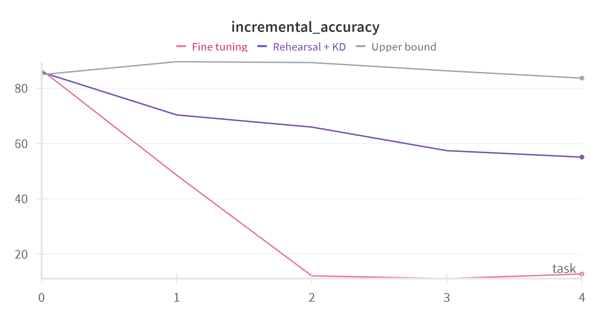

---

# Class incremental learning of the GTSRB dataset

---

The goal of the project is to develop a solution for recognizing images of road signs. This is a classical dataset, ans it is available in many repositories, e.g. [torchvision](https://pytorch.org/vision/stable/generated/torchvision.datasets.GTSRB.html#torchvision.datasets.GTSRB). 

Images have small size (32x32) and the number of data is also small. A deep network can run on a (good) CPU in a reasonable time. GPU will make it faster of course.

The question to be addressed in the project is to introduce sequentially new categories to classify: this is called class-incremental learning in the literature. 

The problem of this learning setting is that it produces "catastrophic forgetting" when new categories (new road signs) to recognize are sequentially added to the recognition system: the old categories are forgotten if nothing is done.

Several strategies can be used to avoid forgetting:

- Rehearsal (maintain a small memory buffer of previous examples)
- Regularization (Knowledge distillation, EWC...)
- Incremental architecture
- ...

The figure below shows two learning strategies when new classes, 8 at each time, are sequentially added. 

- The "upper bound" curve is generated by using all data available (non incremental) and is the expected target performance. 

- The "Fine tuning" is obtained by simply applying a gradient descent on the new data: it is the simplest strategy and it produces catastrophic forgetting. 

- The "rehearsal KD" curve is obtained using a rehearsal memory buffer of size 200 and a Knowledge Distillation between old and new classes.

A few references to help you find a solution:

- Tutorial: https://sites.google.com/view/neurips2022-llm-tutorial

- Recent survey: Zhou, D. W., Wang, Q. W., Qi, Z. H., Ye, H. J., Zhan, D. C., & Liu, Z. (2024). Class-incremental learning: A survey. IEEE Transactions on Pattern Analysis and Machine Intelligence: https://github.com/zhoudw-zdw/CIL_Survey/

- Huge list of papers: https://github.com/ContinualAI/continual-learning-papers

- Van de Ven, G. M., & Tolias, A. S. (2019). Three scenarios for continual learning: https://arxiv.org/abs/1904.07734, https://github.com/GMvandeVen/continual-learning

- A simple strategy: Prabhu, A., Torr, P. H., & Dokania, P. K. (2020). Gdumb: A simple approach that questions our progress in continual learning. In Computer Vision–ECCV 2020: 16th European Conference, Glasgow, UK, August 23–28, 2020, Proceedings, Part II 16 (pp. 524-540). https://github.com/drimpossible/GDumb

A jupyter notebook to help you start (data loders, basline for class incremental learning): 

